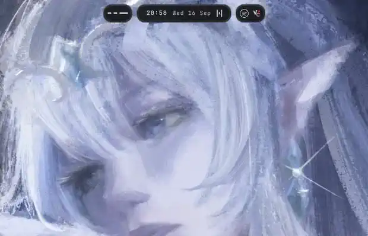
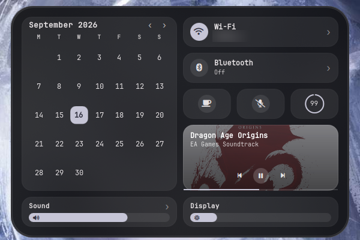
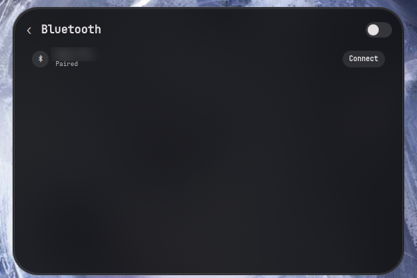
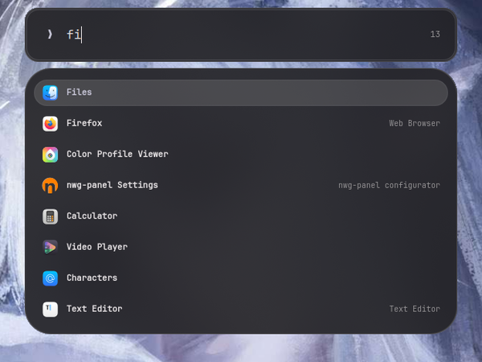
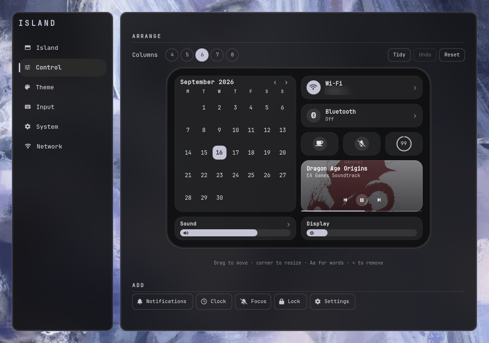

<div align="center">

# dynamite

**one shape, everything**

*Dynamic island for hyprland using quickshell*

A Hyprland desktop shell built around a single morphing pill and two
small circles beside it. No bar. No panels. The island *is* the
interface.

[](#contributing)
[](LICENSE)
[](https://quickshell.org)
[](https://hypr.land)
[](https://wayland.freedesktop.org)

<br>



*One surface. Clock, launcher, control centre, notifications, power —
it becomes each of them and hands the shape back. Workspaces and the
tray flank it, so a glance answers where you are and what is running.*

<sub>Captured frame by frame at 60–90fps so the springs survive, and
timestamped rather than assumed so it plays at real speed;
`docs/demo.mp4` is the same take at full quality. See
`docs/RECORDING.md`.</sub>

</div>

---

## Features

| | |
|:--|:--|
| **One surface, eleven modes** | Clock, split, control centre, launcher, clipboard, pickers, power menu, notifications, history, OSD and polkit prompts — the same shape, morphing. Hovering changes nothing about the shape. |
| **It splits** | Press and hold the pill and the island parts into two lobes either side of a camera housing: the app that's playing on one, the equaliser on the other. The gesture the iPhone's is known for. |
| **Two circles** | Now playing on the left, the control centre on the right. Both are round at rest and both collapse when they have nothing to say; clicking the right one opens the control centre. The right one wears a Wi-Fi glyph with the signal drawn as an arc around it. Workspaces are not a pod — and switching them leaves the clock alone. |
| **Motion that can be interrupted** | Every shape is on a real spring — Apple's two numbers, a response and a bounce — solved per frame rather than sampled into a curve. Reverse one halfway and it carries its velocity through instead of restarting from a standstill. |
| **A picker, not a second settings page** | `Super+Shift+W` opens a grid of wallpapers at their real 16:9; `Super+Shift+T` the palettes, each preset drawn as the desktop it will give you. Arrow keys and Enter. |
| **Theming, from either end** | One wallpaper feeds the shell, GTK3, GTK4, Qt, KDE and Hyprland's window borders through matugen — or pick Gruvbox, Nord or Catppuccin and the same six outputs come from that instead. |
| **A launcher, and its answer** | Empty until you type. Fuzzy over names, keywords, initials and a subsequence fallback, on a second surface below the field. |
| **Notification daemon** | Not a client of one — the shell owns `org.freedesktop.Notifications`. Actions, inline reply, history, Focus mode. |
| **Session lock** | A real `ext-session-lock` surface with PAM, not a shell-out to hyprlock. Laid out the way the macOS login window is: the clock high, the field low with the submit circle and the checking spinner in its right end, Sleep/Restart/Shut Down in the lower left and the network and battery in the lower right. It says why a password failed rather than only that it did — Caps Lock, the reader, the wait — and it fades out over a quarter of a second rather than cutting. |
| **Polkit agent** | Prompts appear in the island. polkitd still decides; only the asking moved. |
| **Continuous gestures** | Four-finger swipes that track your fingers rather than firing on release, over a persistent socket. |
| **Live compositor control** | Blur, gaps, borders, rounding, pointer accel and key repeat, applied as you move the slider. |
| **Switcher and overview** | Alt+Tab across every workspace; `Super+W` for live window thumbnails. |
| **Smart visibility** | Reserve the strip, or let the island move aside only when a window actually reaches it. What Always reserves is the top margin plus the island's height and nothing more, and both are sliders. |
| **Clipboard history** | Filterable and keyboard-driven, backed by cliphist. |
| **System tray** | A card in the control centre: the icons themselves, centred, with no words beside them — an app is already recognisable by its own artwork. A busy tray stays a row of pictures rather than becoming a bar. |
| **Calendar with events** | Reads `.ics` directly — GNOME Calendar's store, vdirsyncer, khal — so nothing extra is needed. |
| **One corner, everywhere** | One slider moves the pill, the panels and Hyprland's windows. A second sets how the corner is *drawn* — a superellipse, not an arc. See `packages/qml-squircle`. |
| **Every shortcut, on one surface** | `Super+/`. Read from `hyprctl binds`, so a bind added to `hypr/binds.lua` appears there and one removed disappears. |
| **Default applications** | Written to `mimeapps.list`, so it is the desktop's answer rather than the shell's private one. |
| **Settings that show their work** | The palette as colour, the pill as a live preview, the control centre as itself — you drag the real cards around. |

<div align="center">


**At rest** — a clock in a black capsule, and the control pod beside
it, wearing the Wi-Fi glyph with the signal swept around it as an arc.
The corner is a true capsule at this height and opens up as the
shape grows.
Three bars and twenty more pixels when a track starts, because the shape
widening *is* the notification. Switch workspace and nothing happens to
the shape at all: the pill keeps the clock rather than flashing a
number, so the time is never somewhere else.



**The control centre** — one black panel on a grid you arrange
yourself.



**A list, in the same panel** — the chevron pushes a page over the
grid rather than opening a window somewhere else.



**The launcher** — the pill is the field and never changes height
while you type; the results are a shelf below it.



**Settings → Control** — the canvas is the panel at its real size,
drawing the real cards. Drag to move, corner to resize.

</div>

---

## Why

Most Wayland setups are a bar, plus a launcher, plus a notification
daemon, plus a lock screen, plus a wallpaper tool. Five programs that
don't know about each other, don't match each other, and each need
configuring separately.

island is one surface that becomes whatever it needs to be. At rest a
pill with the time, now playing to its left and the control pod to its
right.
Start a track and three bars appear beside the date. Click it and it
grows into a control centre; press `Super+R` and it stretches into a
launcher; a notification arrives and it *becomes* the notification,
then hands the shape back.

Because it's one program, the palette is shared, the motion is shared,
and there is one settings app rather than five config files.

**Deeper:** [`docs/DESIGN.md`](docs/DESIGN.md) — the modes, the pods,
the panel, the motion and the shape.
[`docs/NOTES.md`](docs/NOTES.md) — what cost real time to work out.

---

## Install

```bash
git clone https://github.com/therealhadii/dynamite
cd dynamite && ./install.sh
```

Clone it wherever you like — nothing assumes `~/island-dots`.

The script symlinks `hypr/`, `quickshell/island/` and
`fontconfig/fonts.conf` into `~/.config` and `bin/` into
`~/.local/bin`, creates the state directories,
generates `~/.config/island/matugen.toml` with this machine's absolute
paths, puts `~/.config/gtk-{3,4}.0/gtk.css`, `qt6ct.conf` and
`kdeglobals` under the shell's control,
and reports missing dependencies — including the icon font, which it
checks by glyph rather than by name. It installs nothing for you; the
one exception it offers is `/etc/pam.d/island`, which is also the only
thing it does that needs root — say no and the lock screen still works,
just without a fingerprint reader. Re-run it any time; it is
idempotent.

**Requires**

```
hyprland quickshell matugen adw-gtk3-theme qt6ct
wl-clipboard cliphist brightnessctl playerctl hyprshot slurp
hypridle NetworkManager bluez python3
```

Fonts: **JetBrainsMono Nerd Font, v3 or newer**. Every glyph the shell
draws comes from it — `Services/Icons.qml` is the list — and v3 matters:
it moved the whole Material Design range from `U+F500..U+FD46` up to
`U+F0000` and beyond, and the shell uses the new codepoints. A v2 patch
has the same family name and satisfies any check for it, then draws
nothing where the Wi-Fi bars, the settings tab icons and the padlock on
a secured network go. `install.sh` checks for a glyph rather than for a
name for exactly that reason, and reports a v2 patch as something to
replace rather than something to add to. To check by hand:

```bash
fc-list ':charset=f0928' family   # md-wifi_strength_4; v3 only
```

Icons: an XDG icon theme for application icons in the launcher, the
tray and notifications — `adwaita-icon-theme` and `hicolor-icon-theme`.
Cursors ship configured as `Bibata-Modern-Ice`; any installed theme
works, and Settings > Theme lists what you have.

Optional: `qt6-qtimageformats` for WebP, AVIF and JPEG XL wallpapers.
Without it those files are left out of the picker rather than offered
as tiles that cannot be drawn. `fprintd` for fingerprint unlock.

Four-finger gestures need input device access:

```bash
sudo usermod -aG input "$USER"
```

**One thing that will bite you**

The shell is the notification daemon and the polkit agent. mako, dunst
and any external polkit agent must not be running alongside it.

GTK used to be the other one: the theme had to be `adw-gtk3` and not
`adw-gtk3-dark`, because the dark variant loaded a stylesheet that
ignored the matugen overrides. That is no longer true — the shell
imports whichever theme you pick and applies the palette on top of it,
so either works. Pick one in the settings app and nothing else needs
setting by hand.

---

## Configuration

Everything is in the settings app — `Super+S`.

The checkout is code and belongs in git.
`~/.config/island/settings.json` is this machine's state and doesn't.
It's written on first run from the defaults in `Services/Config.qml`
and merged against them on every start, so an update that adds a
setting picks it up without the file being deleted. The merge keeps
values you already have — if a release changes a *default*, delete the
file to take the new one.

`settings.example.json` lists every key and its shipped default. It is
generated from `Services/Config.qml` by `bin/island-gen-example` and is
documentation only; the shell never reads it.

The switch in the window's top-right decides how much of a page there
is: off shows what people reach for, on adds the tuning — pixel sizes,
timings, blur internals. Not every key has a control even then; the
example file is the complete list either way.

Two things the settings app writes are deliberately *not* in that
file, because they are not island's to own: `~/.config/mimeapps.list`
(a browser picked here is the one every application opens links with)
and `~/.local/state/island/apps.lua` (what `Super+X`, `Super+E` and
`Super+B` spawn, overlaid by `hypr/env.lua` so the page never edits the
checkout).

```
packages/             extracted, reusable on their own
                      qml-squircle        continuous corners for QML
bin/                  linked into ~/.local/bin by install.sh
                      island-gestures     libinput gesture daemon
                      island-gtk-apply    GTK/Qt appearance
                      island-calendar     .ics reader
                      island-mime         default applications
                      island-palette      the named palettes
                      island-qt-apply     Qt and KDE colours
                      island-gen-example  regenerates the example config
hypr/                 Hyprland config, one module per concern
fontconfig/           text rendering, linked into ~/.config
pam/                  PAM template for the lock screen
matugen/              Wallpaper → palette templates
quickshell/island/
  Services/           Singletons. No UI.
  Widgets/            Reusable controls. No state.
  Background/         Wallpaper layer
  Island/             The pill, its geometry and mode resolution
  Island/Modes/       One file per mode
  Island/Pods/        The capsules beside the pill
  Lock/               Session lock surface
  Settings/           Settings window and its pages
```

---

## Theming

Colours come from one of two places, and everything downstream is
told the same thing either way:

| Source | What it is |
|:--|:--|
| **Wallpaper** | matugen derives a Material palette from the image. **Derived as** says how far it may stray from it. |
| **Preset** | Gruvbox, Nord, Catppuccin Mocha or Macchiato, used unchanged. `bin/island-palette`. |

A preset is not a seed. Handing matugen gruvbox's accent and letting
it generate gives Material's idea of a palette that happens to be a
gruvbox hue, and gruvbox is not a hue — it is `#282828` behind
`#d4be98`. So the presets fill the same templates matugen does, from a
table instead of from an image, and adding an output works for both.

Nothing in them glows. Every one of these palettes has a loud variant
and a quiet one — gruvbox ships bright accents beside its neutral
ones, Nord leads with a Frost cyan — and the quiet one is taken every
time, because `primary` here is a fill with text on it rather than a
swatch on a page. Gruvbox is **Gruvbox Material**, Nord's accent is
**nord9** rather than nord8.

Under a preset the wallpaper did not choose the palette, so the two
can disagree — a Catppuccin photograph under a Gruvbox shell is two
desktops at once. **Tint the wallpaper** washes it toward the palette
and is on by default. It is a GPU effect on the layer already being
drawn, not a rewritten file, so it costs nothing when it is off and
switches instantly. The alternative would have been shipping a
wallpaper per theme, which is megabytes of somebody else's licensing
in a config repo.

Either way, six outputs:

| Output | Read by |
|:--|:--|
| `~/.local/state/island/colors.json` | the shell, via `Services/Theme.qml` |
| `gtk-3.0/matugen.css` | GTK3, through adw-gtk3 |
| `gtk-4.0/matugen.css` | GTK4 / libadwaita, directly |
| `qt6ct/colors/island.conf` | Qt widget apps, through qt6ct |
| `color-schemes/Island.colors` | KDE apps, through KColorScheme |
| `hyprctl eval` | window borders, via `Services/Compositor.qml` |

Qt is two audiences, not one. A Qt widget application reads whatever
`QT_QPA_PLATFORMTHEME` hands it, which here is qt6ct. A KDE
application does not go through the platform theme at all — it reads
`kdeglobals` directly, on any desktop — so KColorScheme is a second
file in a second format, and both are needed before "Qt apps follow
the wallpaper" is true.

**matugen never writes a file it does not own.** `gtk.css`,
`qt6ct.conf` and `kdeglobals` all hold settings that are somebody
else's — a theme import, a widget style, the fonts — and matugen
aborts its entire run on the first output it cannot write, which used
to take the shell's palette down with one stray root-owned symlink.
So it writes the generated half beside the contested one, and a script
owns the join: `bin/island-gtk-apply` for `gtk.css`,
`bin/island-qt-apply` for the other two. Both are idempotent and safe
to run by hand when something refuses to apply.

Text rendering is `fontconfig/fonts.conf`, linked alongside the rest.
Qt reads fontconfig directly while GTK reads gsettings, so without it
the shell rasterises differently from every other window on the
machine.

Firefox, Chrome and Electron apps do their own theming and won't
follow. That isn't a bug in the setup.

---

## Scope

island is a shell, not a desktop environment. It provides the layer
above your compositor and stays there.

**In scope:** the pill and its modes, notifications, launcher,
clipboard, lock, idle, OSD, theming, wallpapers, settings.

**Not in scope:** window management and tiling (Hyprland's job),
drive mounting (udisks), screen casting (the compositor), a file
manager, a terminal.

---

## Roadmap

- [ ] **Inline reply is send-only.** The notification closes on send;
      the spec has nowhere to put a thread, so a follow-up starts a
      new one rather than threading.
- [ ] **Mixed-DPI is untested.** Each island divides its geometry by
      `Screens.baseScale`, which is exactly 1 when every monitor shares
      a scale — so uniform setups are untouched and only genuinely
      mixed-DPI hardware exercises it. There isn't any here.
- [ ] **Calendar is read-only.** Writing an event back means speaking
      CalDAV, which is a different program.
- [ ] **Recurrence rules are partial.** `FREQ`, `INTERVAL`, `COUNT`,
      `UNTIL`, `EXDATE` and weekly `BYDAY` cover almost everything
      real; the rest of RFC 5545 falls back to the first occurrence.
- [ ] **Fingerprint is untested.** The PAM file ships and the shell
      reports which piece is missing, but no reader has ever been
      attached. An issue either way would be useful.

      The lock screen now arms the reader in its own PAM conversation,
      started when the lock engages rather than when a password is
      submitted — a single conversation would make you wait for
      pam_fprintd to give up before it would let you type. That split
      is the part that has never met hardware. The password path is
      unchanged and does not depend on it.

      One rough edge is known from reading rather than running: with
      `pamConfig` set to `island`, *submitting* a password still walks
      the whole stack, so pam_fprintd gets its swipes in before
      pam_unix is asked. It predates the split.
- [ ] **The layout editor has not been driven by a real pointer.** Two
      defects were found and fixed by reading it — the grip's inset and
      a missing height ceiling — but none of it has met an actual mouse.
- [ ] **A `SelectRow` commits on options change.** An open dropdown
      writes a value back when its list repopulates underneath it.
- [ ] **Continuous gestures need a daemon.** `bin/island-gestures`
      reads libinput because Hyprland's `gesture` action fires once on
      release. A note rather than a task: it needs a progress callback
      upstream.

---

## Contributing

v1.0.0, and tested on one machine. If you try it and something breaks,
[open an issue](https://github.com/therealhadii/dynamite/issues/new) —
that's more useful than a star.

`docs/RECORDING.md` covers how the demo was captured — no recorder
package needed — if you want to show a variation.

---

<div align="center">

Built on [Quickshell](https://quickshell.org) (LGPL-3.0).
GTK/libadwaita theming follows the method documented by
[Noctalia](https://docs.noctalia.dev).

A fork of [island-dots](https://github.com/Sid-5137/island-dots),
with the control centre, the pods and the workspace label changed here.

**GPL-3.0** · Copyright © 2026 Siddhartha Mallavolu

</div>
